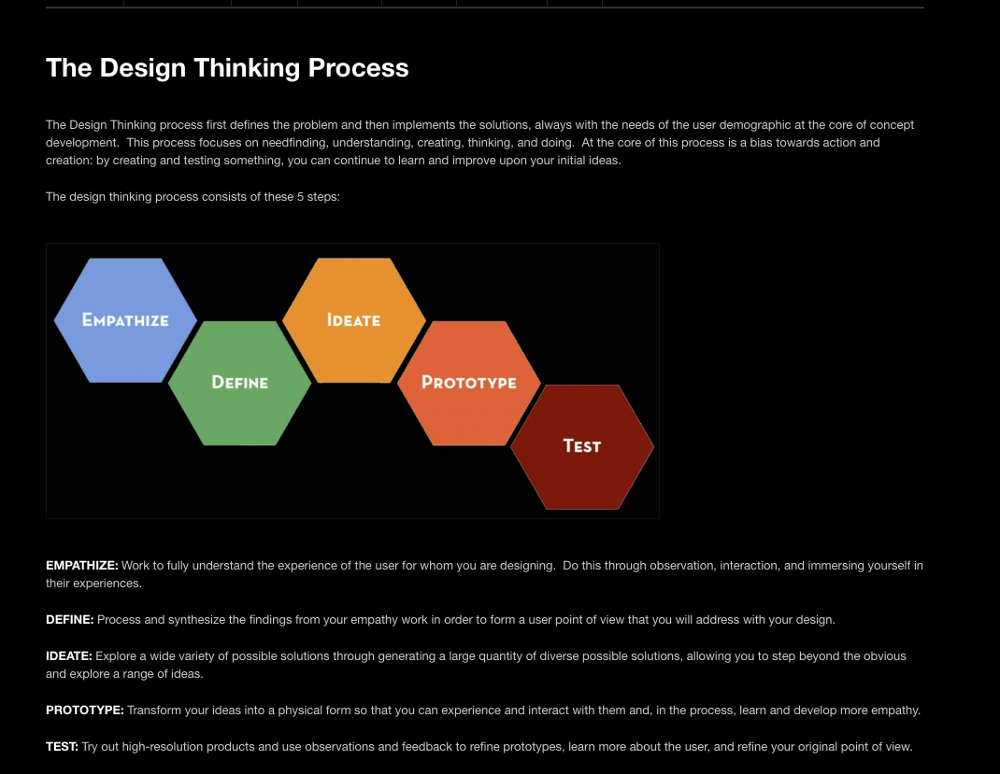

# Project Instructions

## Mission (problem to solve)

**Create and Document an Organization**
Design an organization and document it (using simple html) so that your Investors (Angel Investors - for profit startup, Bosses - an established business unit, Donors - non-profit) can approve the projects and fund them.

## Technologies / Topics to Learn

These basic work flow and information sharing skills are critical for all your projects in this class (and in general it is important to know how to share work and to keep old versions)

* **HTML** basics - (headers, lists, links, images, text and paragraphs)
* **Git** workflow - branches (master and development branches), the ability
to roll back as needed, and shared work (submitting & reviewing -- pull requests)

## Design Thinking
adapted for this course -- see:
[Design Thinking Founders](http://dschool.stanford.edu/dgift/)
and [ideou](http://www.ideou.com)

#### Task Overview

Design an organization with a mission (non-profit or for profit) - all your
projects will be reviewed within the context of your chosen mission and
approved when they align.

#### Empathathy

* Think about this organization from the perspective of your Donors (teachers)
* Think about this organization from the perspective of your interests as an organization founder

#### Define

* Choose an organization name
* Create an organization mission - _Why does your organization design technology products?_
* Create an organization logo

#### Ideate - try out several ideas

* Create 3 names and 3 logs
* Choose 3 available projects that are interesting to you
* Discuss within your team at least 3 different projects and how they fit within the context of your organization

#### Prototype -- focused plan (choose a way forward)

* Sketch 3 versions of your organization's website include: (Name, logo, mission and one project) -- **Take photos and print copies** (you can both scan and copy your sketches with the photocopier / printer)
* Show your sketches to another group of students and explain how the project on each page relates to your mission
* Find our what part of each sketch is best liked by the other group - write notes on what they liked best

#### Prototype -- Smallify, Build and Test

* Adjust your design (take the best parts of each design)
* Create this web page using the provided template - do commits in stages (**smallify** - your git logs will be checked to ensure you are doing this)

**Smaller Parts**
* Commit after successfully renaming web title (tab title) and the top header on the web page with the name of your Organization
* Commit after writing and adding your Organization mission (have another student / group your progress at this point to ensure good grammar and cohesive content)
* Commit after linking your template project summary
* Commit after writing your project summary and adding photos
* Have another student / group review your web pages (and make adjustments)

**Integration**
* Publish your website live on Github (go to settings - use the **Master branch**)
* Make sure your website works - test it on both a computer and on a cell phone

#### Prototype Adjust until Accepted

* Show your Investors (teachers) this website when you are ready
* Make adjustments as needed
* Your project will be linked to the class website when accepted by the investors

## Technical Steps

1. Download/install the Text Editor **Atom** (install the **git-plus** plug-in to your Editor & maybe other plug-ins too -- look on the web to figure out how to do this)
2. Download/install the program **GitHub Desktop**
3. Create a login to GitHub (please do not complete the profile - just use your LAS email and provide the minimum information possible for privacy reasons!)
4. Update the page title (in the top of the web-tab with your org name)
5. Put your Org name centered at the top of the webpage
6. Include an image of your logo
7. Add your mission to the page
8. Publish your website (go to your project settings and in the **GitHub Pages** area choose **master branch** to be your source for the webpage)
9. Complete your web page project report 1 (include photos of your sketches) AND Link this report to your main web page

## Share
1. Share this link with your investors for approval
2. Demo your project at home room

## Design Thinking image for the curious
Here is an image of Design Thinking:

